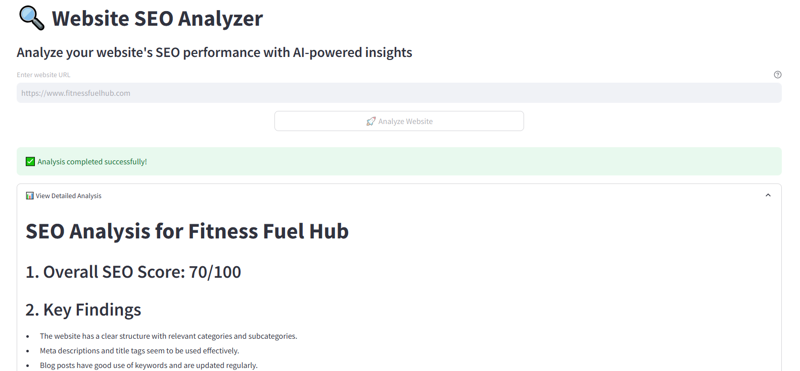

# websiteseoanalyst
Streamlit App to analyze the website SEO status and generate a summarized report that can be shared with website owners for taking some actions to improve the SEO score.



# Website SEO Analyst

An AI-powered SEO analysis tool that provides comprehensive website analysis using OpenAI's GPT-4 model and Streamlit.

## Features

- Real-time website content analysis
- Detailed SEO recommendations
- Downloadable analysis reports
- User-friendly interface
- Technical SEO insights
- Content optimization suggestions

## Prerequisites

- Python 3.8 or higher
- OpenAI API key
- Git (for version control)

## Installation

1. Clone the repository: 
git clone https://github.com/mridulja/websiteseoanalyst.git
cd websiteseoanalyst

2. Create and activate a virtual environment:
source venv/bin/activate  # On Windows, use: venv\Scripts\activate

3. Install the required dependencies:
pip install streamlit openai python-dotenv beautifulsoup4 requests


## Configuration

1. Create a `.env` file in the project root:

```
OPENAI_API_KEY=your_openai_api_key
```

2. Add your OpenAI API key to the `.env` file:

```
OPENAI_API_KEY=your_openai_api_key
```


## Usage

1. Start the Streamlit application:
streamlit run app.py

2. Open the provided URL in your web browser to access the tool.

3. Enter the URL of the website you want to analyze and click "Analyze".

4. The tool will analyze the website and provide a detailed report with recommendations for improving the SEO score.

5. You can download the report as a PDF or HTML file.


├── .env                # Environment variables (not in git)
├── app.py              # Streamlit app
├── requirements.txt      # Project dependencies
├── README.md           # Project documentation


## Dependencies

- `streamlit`: Web application framework
- `openai`: OpenAI API client
- `python-dotenv`: Environment variable management
- `beautifulsoup4`: HTML parsing
- `requests`: HTTP client

## Environment Variables

Required environment variables in `.env`:
- `OPENAI_API_KEY`: Your OpenAI API key

## Common Issues and Solutions

1. **OpenAI API Key Error**
   - Ensure your API key is correctly set in the `.env` file
   - Verify the API key is valid and has sufficient credits

2. **Website Access Issues**
   - Check if the website is accessible
   - Verify the URL includes 'http://' or 'https://'
   - Some websites might block automated access

3. **Rate Limiting**
   - The tool includes built-in delays to respect website rate limits
   - Consider increasing delays if you encounter blocking

## Contributing

1. Fork the repository
2. Create a feature branch
3. Commit your changes
4. Push to the branch
5. Create a Pull Request

## Security Notes

- Never commit your `.env` file
- Keep your OpenAI API key secure
- Regularly rotate your API keys
- Use environment variables for sensitive data

## License

This project is licensed under the MIT License - see the LICENSE file for details.

## Support

For support, please open an issue in the GitHub repository.

## Acknowledgments

- OpenAI for providing the GPT-4 API
- Streamlit for the web application framework
- Beautiful Soup for HTML parsing capabilities